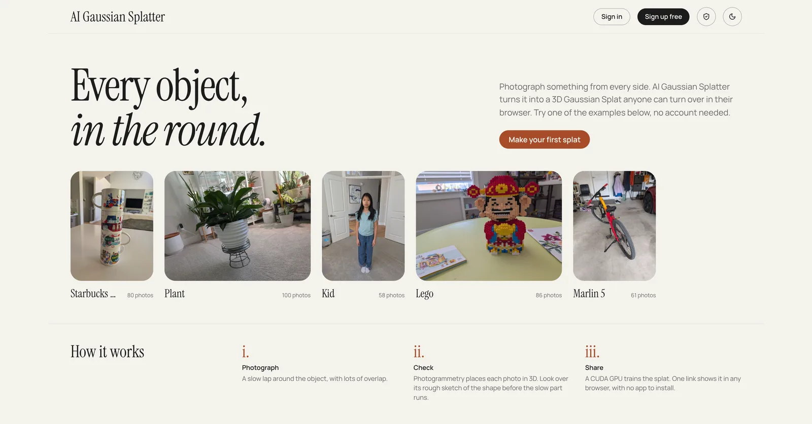
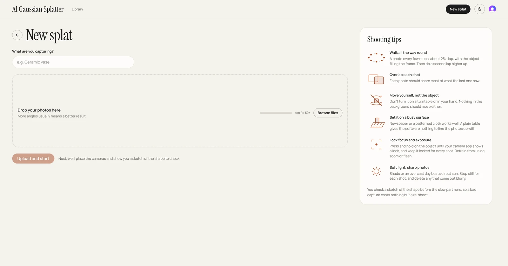
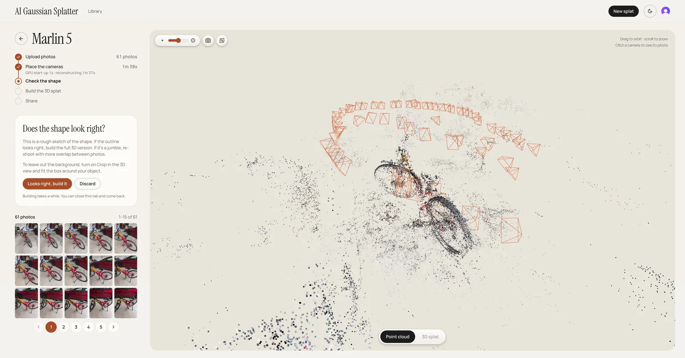
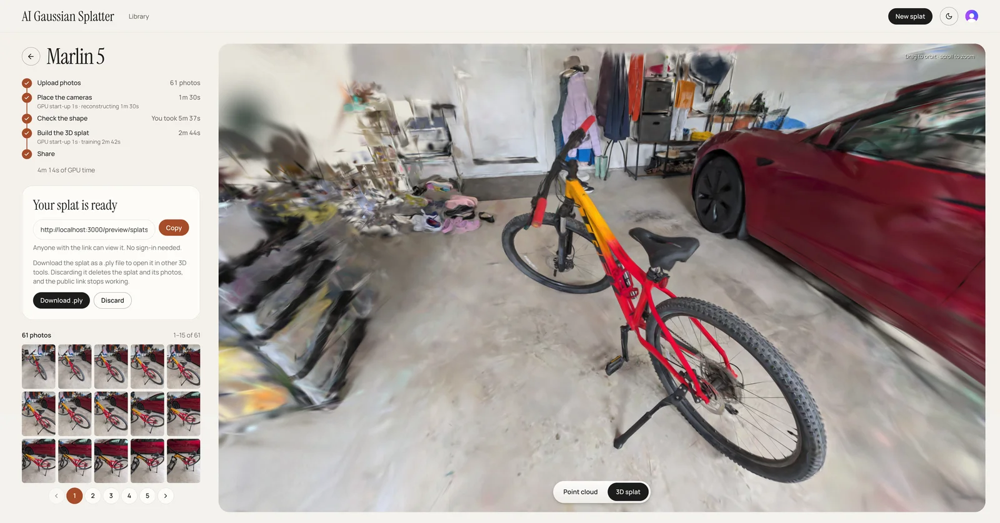
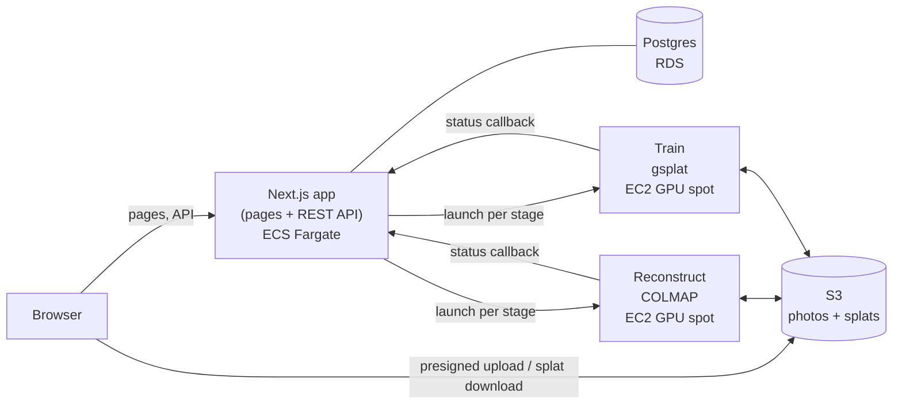

# AI Gaussian Splatter

Upload multi-angle photos of a physical object, get back a real-time, interactive 3D Gaussian Splat you can view in the browser and share. Photogrammetry places the photos in 3D, and AI training on a CUDA GPU in the cloud turns them into the splat.

> 🚧 **Under construction.** The pipeline has run end to end on a local GPU. The AWS stack has been deployed before for testing, but is currently torn down while development continues. Several gaps remain. See [State / what's next](AGENTS.md#11-state--whats-next).

<p>
  
  
  
  
</p>

The landing page, the upload page with its shooting tips, then a splat of a bike built from 61 photos. The third view is the review step: the point cloud reconstructed from the photos, with an orange frame marking where each photo was taken. The last is the finished 3D Gaussian Splat, ready to share.

Built with the help of [Claude Code](https://claude.com/product/claude-code) and Cursor.

- [1. What it does](#1-what-it-does)
- [2. How it works](#2-how-it-works)
- [3. Cost and abuse controls](#3-cost-and-abuse-controls)
- [4. Tech stack](#4-tech-stack)
- [5. Repository layout](#5-repository-layout)
- [6. Getting started](#6-getting-started)
- [7. Documentation](#7-documentation)
- [8. License](#8-license)

---

## 1. What it does

A 3D Gaussian Splat represents an object as millions of small, semi-transparent, colored blobs (Gaussians). Unlike a mesh, it captures fine detail and view-dependent shine, and it renders in real time in a browser.

1. **Upload.** Sign in and drop in 20–100 photos taken while walking around one object. About 50 well-spaced shots work best: every side, a couple of heights, each overlapping its neighbors. Coverage matters more than count ([Capture](RUNBOOK.md#15-capture)).
2. **Reconstruct.** COLMAP's photogrammetry (structure-from-motion) works out where each photo was taken and builds a sparse point cloud of the object.
3. **Review.** Check the point cloud and camera positions, and optionally draw a crop box around the object to drop the background from the result.
4. **Train.** gsplat trains a Gaussian Splat on the photos with its CUDA kernels on an NVIDIA GPU.
5. **View and share.** Orbit the splat in the browser, share a public link (with an Open Graph preview image), or download the `.ply` to edit in other splat tools.

The AI training is per-object gradient descent through a differentiable renderer, not a pretrained model ([Pipeline](ARCHITECTURE.md#2-pipeline)).

---

## 2. How it works



- **One Next.js app serves both the pages and the REST API**, so there is one deploy and one TypeScript codebase ([API design](ARCHITECTURE.md#4-api-design)).
- **Photos go straight from the browser to S3** through presigned upload URLs, so large uploads never pass through the web server.
- **Each worker stage gets its own short-lived GPU spot instance.** The web app launches it, the instance runs the stage's container, reports back through a callback route, and terminates itself ([Compute](ARCHITECTURE.md#3-compute)).
- **The viewer loads a compressed `.spz` file**, about a twelfth the size of the `.ply` offered for download.

---

## 3. Cost and abuse controls

The app is public, and every splat costs real GPU time, so spending is bounded at several levels ([Abuse protection](ARCHITECTURE.md#10-abuse-protection)):

- **Pay only while working.** No always-on GPU fleet or queue. A spot instance exists only for the minutes one stage runs, and the web tier runs on Fargate Spot.
- **Runaway instances get killed.** Each worker instance schedules its own shutdown at boot, and a sweeper Lambda terminates any that outlive the ceiling anyway.
- **Rate limits** per IP and per user, plus a global daily cap on worker instance launches.
- **Upload limits** on photo count and size. S3 itself enforces the size, since it's signed into each upload URL.
- **A site-wide switch** pauses all GPU processing within a minute, with no deploy.
- **An AWS Budget** alerts on any spend the request path never sees.

---

## 4. Tech stack

| Area | Choices |
| --- | --- |
| Frontend | Next.js (App Router) · Tailwind CSS · Radix UI · SWR · Zustand · React Three Fiber · Spark (splat rendering) |
| Backend | Next.js Route Handlers · Drizzle ORM · Postgres (RDS) · Clerk (auth) |
| Worker | Python · COLMAP · gsplat · CUDA, in Podman/Docker containers |
| Infra | Terraform · ECS Fargate (Spot) behind an ALB · EC2 GPU spot · S3 · ECR · Lambda · Route 53 / ACM |
| CI/CD | GitHub Actions, signing in to AWS through OIDC (no stored keys) |
| Tooling | pnpm · uv · Biome · Ruff · mypy · Vitest · Playwright |

---

## 5. Repository layout

A monorepo of three independent packages, plus the scripts that operate them:

| Path | What it holds |
| --- | --- |
| `web/` | The Next.js frontend, and the REST API under `web/app/api/v1/` (auth, rate limiting, worker-job orchestration). |
| `worker/` | The Python reconstruct-and-train pipeline, built into one container image per stage. |
| `infra/` | The Terraform configuration for the whole AWS stack, in one state. |
| `scripts/` | Shell scripts for local development and for operating the deployed AWS account. |

---

## 6. Getting started

Developed and tested on Fedora Linux, which is why [`RUNBOOK.md`](RUNBOOK.md) uses Podman and talks about SELinux rather than Docker.

You'll need:

- Node.js at the version in `.nvmrc` (run `nvm use`), and pnpm.
- [uv](https://docs.astral.sh/uv/) for the Python worker.
- Podman, for the local Postgres container.
- An NVIDIA GPU with its driver and `nvidia-container-toolkit`, only to run the pipeline itself ([Worker (local pipeline run)](RUNBOOK.md#14-worker-local-pipeline-run)).

Postgres runs in a container, so it needs no install on the host. Before `pnpm dev`, do the one-time setup in [Web (frontend + REST API)](RUNBOOK.md#12-web-frontend--rest-api), which starts that container and fills in the web app's `.env`.

```bash
# Web (frontend + API)
cd web && pnpm install && pnpm test && pnpm dev

# Worker
cd worker && uv sync --group dev && uv run pytest

# Infra
pnpm run infra:check && terraform -chdir=infra test
```

`scripts/dev/run-tests.sh` runs every lint, typecheck and test suite at once ([Full test suite](RUNBOOK.md#19-full-test-suite)).

---

## 7. Documentation

Each fact lives in exactly one of these:

| Doc | Read it for |
| --- | --- |
| [`ARCHITECTURE.md`](ARCHITECTURE.md) | Why the system is built this way: decisions, rejected alternatives, and costs accepted. |
| [`RUNBOOK.md`](RUNBOOK.md) | How to develop locally, deploy to AWS, troubleshoot, and tear down. |
| [`AGENTS.md`](AGENTS.md) | Conventions, gotchas that break things, and current state. Written for contributors and coding agents alike. |

---

## 8. License

MIT. See [LICENSE](LICENSE).
